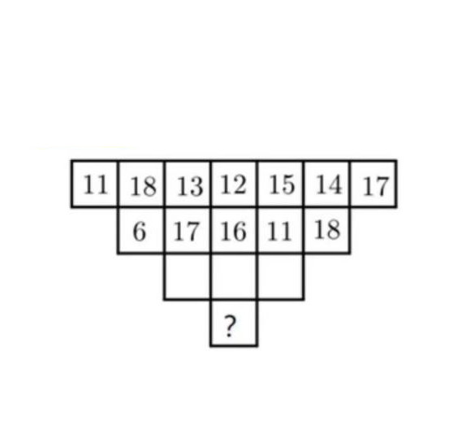
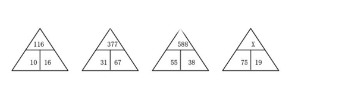

# 这个是一个可以提升数感的游戏
1. 数学的奥秘用各种逻辑谜题来提高你的智商。用不同水平的数学游戏挑战你自己，扩展你的思维极限。脑力游戏是用智商测试的方法来准备的。
2. 你将解决几何图形中数字之间的关系，并在最后完成缺失的数字。每一款益智游戏和脑力游戏都有着不同的层次。具有很强的分析思维能力的玩家能立即找出解决方案。
3. 数学游戏真的像智商测试一样开阔你的思维。逻辑难题为先进的思维和思维速度创造了新的方式。它们使脑细胞之间的联系更加紧密。是你更加的智慧
4. 数学谜语通过隐藏在几何图形中的脑力游戏展示你的数学天赋。你将通过探索几何图形中数字之间的关系来训练你的大脑的两个部分，你将敏锐地扩展你的思维极限。

## 实例
1. 
1. 

## 联系我
1. 如果你有好的题目可以提交给我，我可以吧你的题目提交的游戏里面让大家体验一下你的智慧
### <nuoter.wuyake@gmail.com>

[豫ICP备2020030793号-1](https://beian.miit.gov.cn/)

